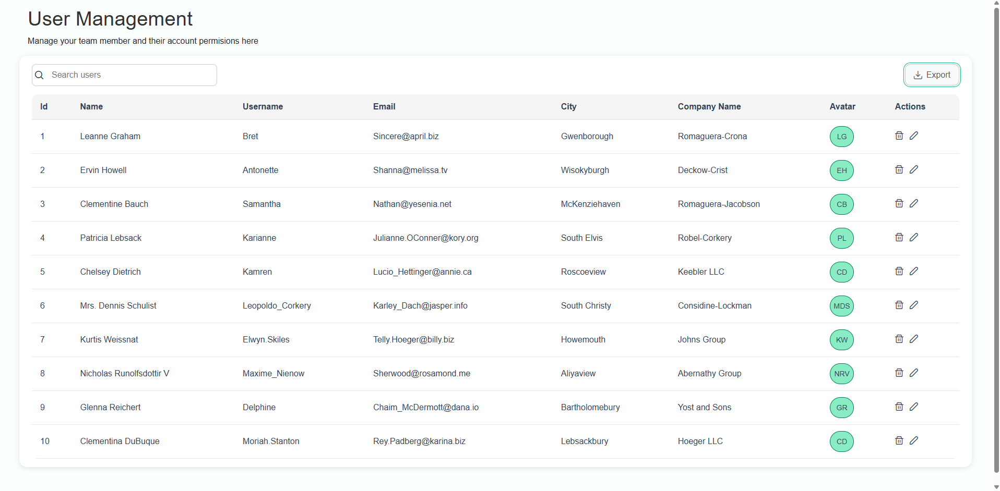

# Angular Challenge

This is an Angular technical challenge consuming the JSONPlaceholder public API.  
It demonstrates the use of feature-based architecture, services, components, guards, and interceptors.

## Features
- User feature module (`user-component`) with state management
- Core module with constants, guards, interceptors, services
- Shared utilities and helper functions
- Modular layout (`main-content`)

## 💻 Capturas de pantalla
 
## Technologies
- Angular
- TypeScript
- JSONPlaceholder API
  

## Getting Started
git clone
  ```bash
  https://github.com/JaredTc/Angular-Challenge.git
  ```

